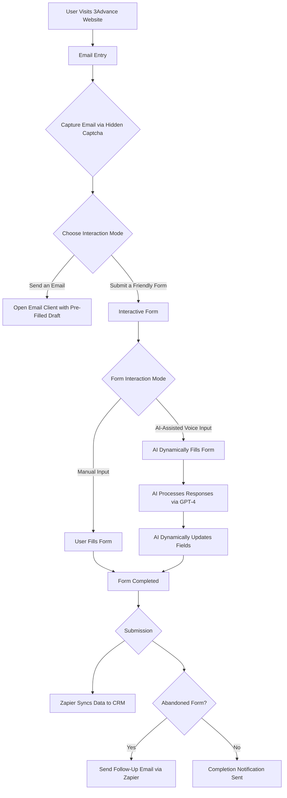

# 3Advance AI-Enhanced Form System

> A dynamic, AI-enhanced form experience using QuillForms with voice capabilities and conversational AI integration.

## Table of Contents
- [Overview](#overview)
- [Features](#features)
- [System Architecture](#system-architecture)
- [User Flow](#user-flow)
- [Cost Structure](#cost-structure)
- [Technical Considerations](#technical-considerations)
- [Getting Started](#getting-started)

## Overview

This project implements an intelligent form system that combines QuillForms with AI capabilities to create an engaging user experience. The system leverages OpenAI's technologies for voice interaction and integrates with existing CRM systems through Zapier.

## Features

### Form Building (QuillForms)
- Sleek, branded form experience
- Two-part form structure:
  - Basic form for initial information
  - Optional detailed form for additional data
- Hidden captcha for secure email capture

### AI Integration
- Real-time speech-to-text using OpenAI Whisper
- Dynamic form filling with GPT-4
- Voice interaction with fallback to manual input
- Interactive button prompt: *"Wanna do it the easy way? click here!"*

### Data Management
- Seamless Zapier integration with CRM systems
- Field-by-field data syncing
- Automated follow-up system for abandoned forms
- Personalized email recovery system

## System Architecture


### Flowchart Representation 2 (Interactive)



# Quiet Collection App Flow

## **Flow Overview**

```mermaid
graph TD;
    A[Landing Page] -->|Click "Explore the Collections"| B[Collections Page];
    B --> C[Advent Collections]
    B --> D[Blessings]
    B --> E[Borrowed Prayers]
    C -->|Select Collection| F[View Sample & Purchase Options]
    F -->|Buy for Myself| G[Payment Processing]
    F -->|Buy as a Gift| H[Gift Selection]
    F -->|I Was Gifted This| I[Redeem Gift]
    F -->|Buy the Advent Bundle| J[Payment Processing]
    D -->|Select Blessing| K[Purchase Option]
    E -->|Select Prayer| L[Audio Player & Transcript]
    L -->|Play Audio| M[Playback Controls]
    M -->|Phone Locked| N[No Pause/Skip Available]
    B --> O[Settings]
    O --> P[Account]
    O --> Q[About]
    O --> R[Logout]
```


## User Flow

1. **Email Entry**
   - Initial form access
   - Secure email capture via hidden captcha

2. **Interaction Mode Selection**
   - Email client option with pre-filled draft
   - Interactive QuillForms experience

3. **Form Completion**
   - Manual input option
   - AI-assisted voice input
     - Dynamic field population
     - Real-time feedback and clarification

4. **Submission and Follow-up**
   - Zapier CRM synchronization
   - Automated follow-up for abandoned forms

## Cost Structure

| Feature | Tool/Technology | Cost Estimate |
|---------|----------------|---------------|
| Form Builder | QuillForms | $99/year ($8.25/month) |
| Voice Input | OpenAI Whisper API | ~$0.006/minute |
| AI Processing | OpenAI GPT-4 API | ~$0.03 per 1k tokens |
| Zapier Integration | Existing Plan | No additional cost |

### Base Implementation Cost: $1,100
Includes:
- QuillForms setup and customization
- Whisper and GPT-4 integration
- Workflow design and testing

### Monthly Operating Costs
- Estimated range: $10–$50 for moderate usage
- Usage-based pricing for AI services

## Technical Considerations

### Scalability
- Flexible API usage limits
- Upgradeable QuillForms plan
- Modular architecture for easy expansion

### Data Privacy
- GDPR/CCPA compliance
- Secure data processing
- Protected user information handling

## Getting Started

1. **Design Finalization**
   - Complete QuillForms implementation design
   - Finalize user interface elements

2. **Proof of Concept**
   - Develop AI voice integration
   - Test GPT-4 form filling capabilities

3. **Integration**
   - Set up Zapier workflows
   - Configure CRM connections

4. **Testing**
   - Conduct user flow testing
   - Gather and implement feedback


   flowchart LR
    Landing[Landing Page] --> Collections[Collections Page]
    
    Collections --> Prayers[Borrowed Prayers]
    Collections --> Psalms[Psalms]
    Collections --> Advent[Advent Collections]
    Collections --> Blessings[Blessings]
    
    Prayers --> AudioPlayer[Audio Player with Transcript]
    Psalms --> AudioPlayer
    
    Advent --> Collection[Peace, Compassion, Love, Hope]
    Collection --> Purchase[Buy for Myself]
    Collection --> Gift[Buy as a Gift]
    Collection --> Redeem[I Was Gifted This]
    Collection --> Bundle[Buy the Advent Bundle]
    
    Blessings --> Buy[Buy Blessings]
    
    Landing --> Settings[Settings Page]
    Settings --> Account[Account, About, Logout]
    Account --> Restore[Restore Purchases]
    Account --> Delete[Delete Account]

## License

This project is proprietary and confidential to 3Advance.

---
For more information, contact [3Advance Support](https://3advance.com/contact)
